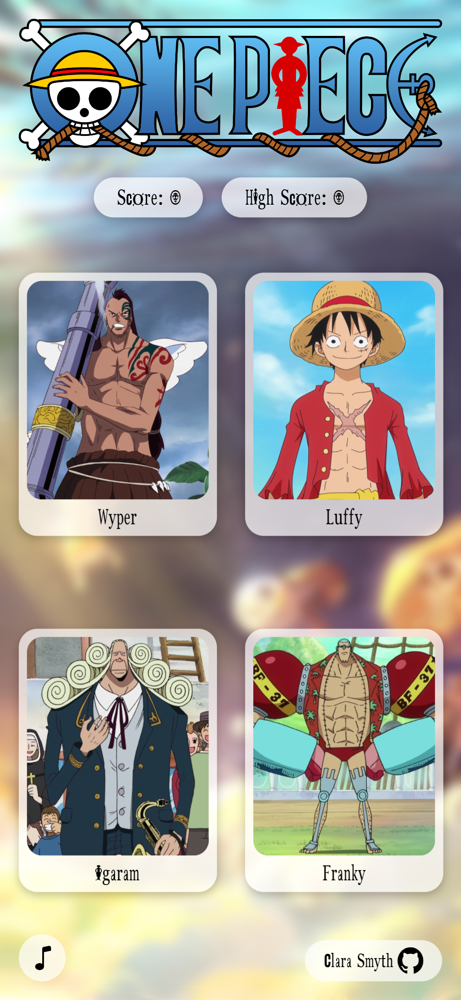

	<h1>Memory Game
	 
        
		
		 
	</h1>
	<h3><b><a href="https://rique2x.github.io/React-Memory-Card/">View Live Demo</a></b></h3>

## Description

This project is a Memory Game based on characters from the anime One Piece created as part of [TheOdinProject](https://www.theodinproject.com) curriculum.

To see the assignment details - [Click Here](https://www.theodinproject.com/lessons/node-path-javascript-memory-card)

## Built Using

- React 
- SASS 

#### Other tools used

- Prettier 

## Credits

#### Icons

- [React Icons](https://github.com/react-icons/react-icons)
- [Bootstrap Icons](https://github.com/twbs/icons)
- [Simple Icons](https://simpleicons.org/)

#### Images

- Character & Wanted Images - [Fandom One Piece Wiki](https://onepiece.fandom.com/wiki/One_Piece_Wiki)
- Going Merry Animated Background - [Reddit User u/laxusdreyarligh](https://www.reddit.com/r/OnePiece/comments/j8mctl/i_animated_a_going_merry_wallpaper/)

#### Sounds

- Card Flip Sound Effect - [Pixabay User Splashdust](https://pixabay.com/hu/sound-effects/flipcard-91468/)

## Gallery

#### Desktop

#### Mobile

